# AI-Assisted Academic Integrity Risk Detection System

A final year MCA industry project developed in collaboration with Xebia, UPES Dehradun.

This system detects potential academic integrity risks in student submissions using artificial intelligence, machine learning, and behavioral analysis. Instead of simply checking for copied content like traditional plagiarism tools, this system looks at three different signals together and produces a single risk score to help faculty identify suspicious cases.

> The system never makes direct accusations. It only flags cases for faculty review. All final decisions remain with the faculty member.

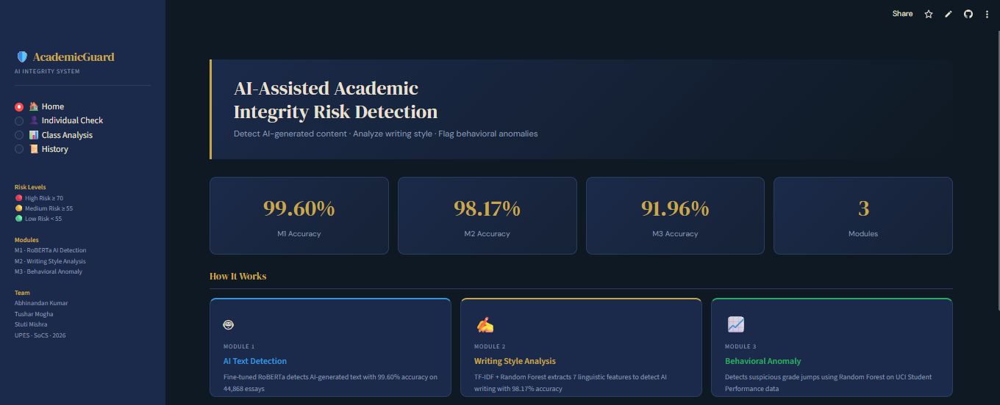

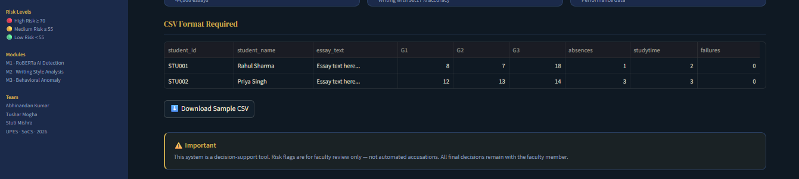

---

## What Problem Does This Solve

Traditional plagiarism tools like Turnitin can only detect copied content. They completely fail against three modern forms of academic misconduct:

- **AI-generated answers** — content produced by ChatGPT or similar tools is original and bypasses all similarity checkers
- **Suspicious grade patterns** — a student who consistently scores low but suddenly gets a very high final grade goes completely unnoticed

This system addresses all at once.

---

## How It Works

Student data — essay text and grade records — is passed through three independent detection modules. Each module analyzes a different signal. The outputs are combined into a single composite risk score, and the student is classified as Low Risk, Medium Risk, or High Risk.

---

## Modules

### Module 1 — AI Content Detection (RoBERTa Transformer)

Uses a fine-tuned RoBERTa transformer model trained on 44,868 essays from the DAIGT-V2 dataset. The model learned to distinguish between human-written essays and essays generated by AI tools including ChatGPT, GPT-4, Llama, Falcon, and Mistral.

- Model available at: https://huggingface.co/Tushar101/module1-roberta
- Training Accuracy: 99.60%
- Trained on Google Colab using Tesla T4 GPU
  
  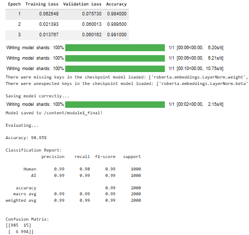
  
---

### Module 2 — Writing Style and AI Detection (Random Forest + TF-IDF)

Extracts 7 handcrafted linguistic features from the essay — average word length, sentence length, vocabulary richness, punctuation usage, paragraph count, linking word frequency, and capital letter ratio. These are combined with TF-IDF word pattern features and classified using a Random Forest model.

- Accuracy: 98.17% on 8,968 test essays
- Runs on a standard laptop — no GPU needed
- Labels the essay as **AI Generated** or **Human Written**

**Model Training & Accuracy:**

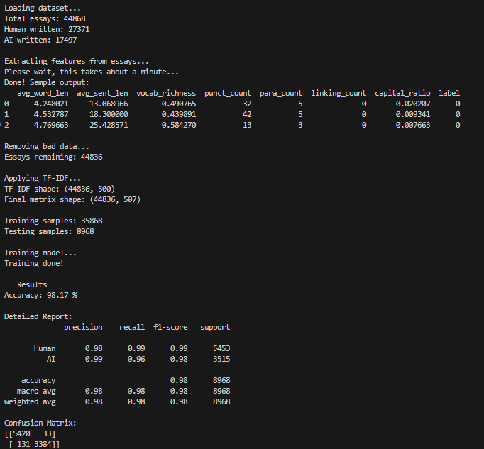

**Sample Predictions:**

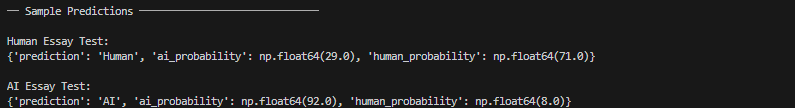

---
  
### Module 3 — Behavioral Anomaly Detection (Random Forest + Rule-Based Logic)

Analyzes student grade records (G1, G2, G3) along with absences and failures. If a student's final grade jumps significantly above their established baseline, the system flags it as suspicious. Uses a Random Forest model combined with rule-based logic.

- Dataset: UCI Student Performance (991 student records)
- Accuracy: 91.96%
- Detects sudden grade spikes, high absence combined with high marks, and inconsistent patterns

**Model Training & Accuracy:**

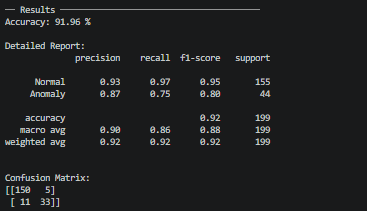

---

## Dashboard

The system has an interactive dashboard built with Streamlit where faculty can analyze individual students or upload an entire class CSV file for bulk analysis.

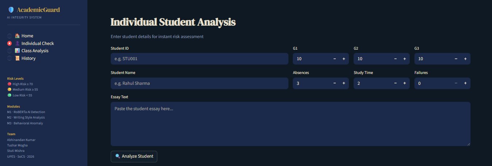

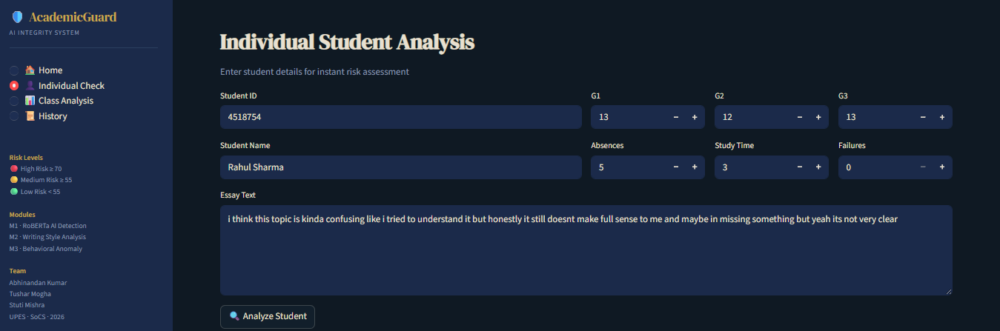

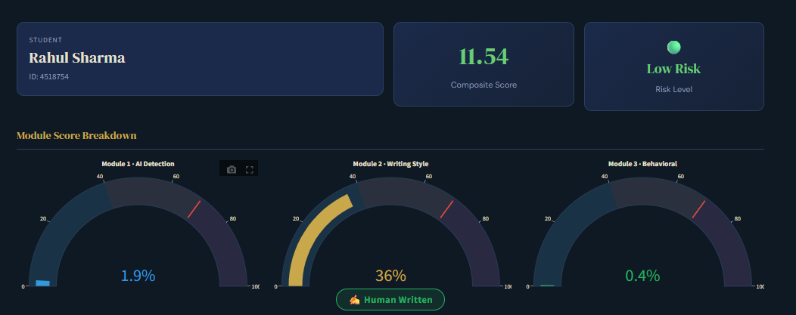

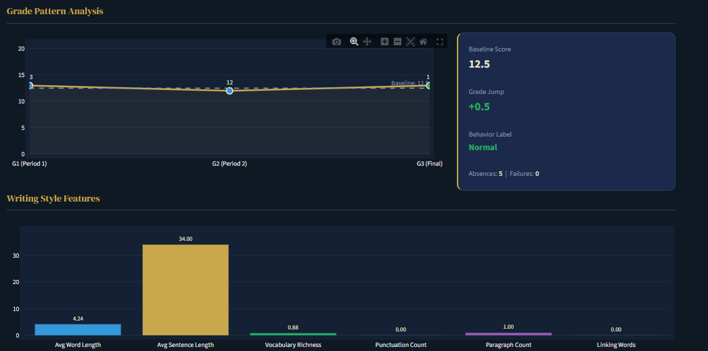

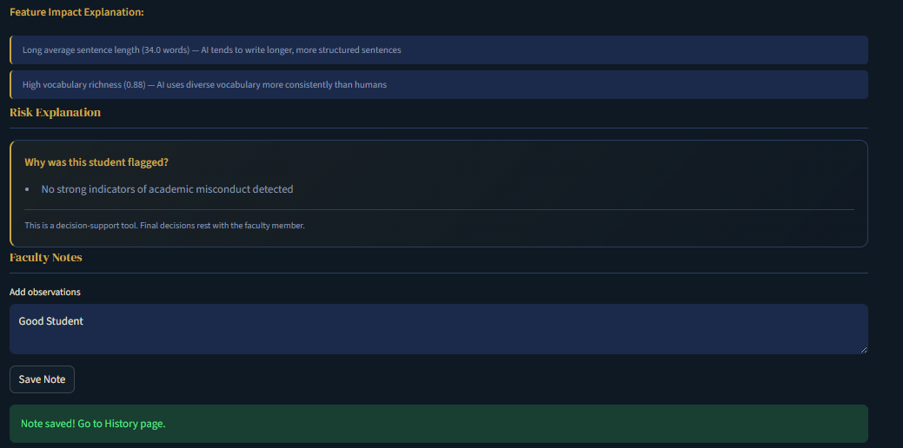

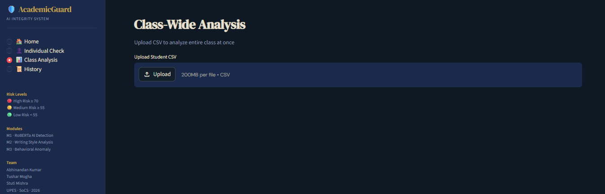

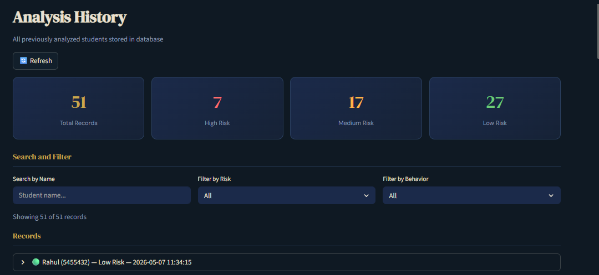

---

### Individual Student Check

Faculty enters the student ID, name, essay text, and grade information. The system runs all three modules and shows a detailed report including module scores, grade pattern chart, writing style features, SHAP explanation, risk explanation, and a faculty notes section.

### Class Analysis

Faculty uploads a CSV file with all student data. The system analyzes all students at once and shows a risk distribution chart, score distribution histogram, module comparison, and a full results table with download option.

### History

Every analysis is automatically saved to the database. The History page shows all previously analyzed students with search and filter options. Faculty can add notes to any record and view them later.

---

## Datasets Used

| Dataset | Size | Purpose |
|---|---|---|
| DAIGT-V2 (Kaggle) | 44,868 essays | Module 1 and Module 2 training |
| PERSUADE 2.0 (GitHub) | 25,996 essays | Considered for Module 2, not used in final implementation |
| UCI Student Performance (UCI ML Repository) | 991 records after cleaning | Module 3 training |

---

## Risk Score Logic

Each module produces a score from 0 to 100. These are combined into a composite score with dynamic weighting:

- If behavioral anomaly is detected: Module 1 × 30% + Module 2 × 30% + Module 3 × 40%
- If no behavioral anomaly: Module 1 × 40% + Module 2 × 40% + Module 3 × 20%

| Risk Level | Composite Score |
|---|---|
| 🔴 High Risk | 70 and above |
| 🟡 Medium Risk | 55 to 69 |
| 🟢 Low Risk | Below 55 |

---

## Datasets Used

| Dataset | Size | Used For |
|---|---|---|
| DAIGT-V2 (Kaggle) | 44,868 essays | Module 1 and Module 2 |
| UCI Student Performance (UCI ML Repository) | 991 records after cleaning | Module 3 |

---

## Tech Stack

| Category | Tool |
|---|---|
| AI Detection | RoBERTa (HuggingFace Transformers) |
| Text Classification | TF-IDF + Random Forest (scikit-learn) |
| Behavioral Detection | Random Forest + Rule-Based Logic |
| Explainability | SHAP |
| Dashboard | Streamlit |
| Backend API | FastAPI |
| Database | Supabase (PostgreSQL) |
| Model Storage | HuggingFace Hub |
| Training Platform | Google Colab (Tesla T4 GPU) |
| Version Control | Git + GitHub |

---

## Key Features

- Detects AI-generated content  
- Detects abnormal academic behavior  
- Uses both ML and rule-based logic  
- Gives explainable output   

---

## Team

- Abhinandan Kumar (590013661)
- Tushar Mogha (590010547)
- Stuti Mishra (590015857)

School of Computer Science, UPES Dehradun — 2026

- Industry Mentor: Ms. Deborah Joy (Xebia)
- UPES Mentor: Dr. Sonam Saluja
