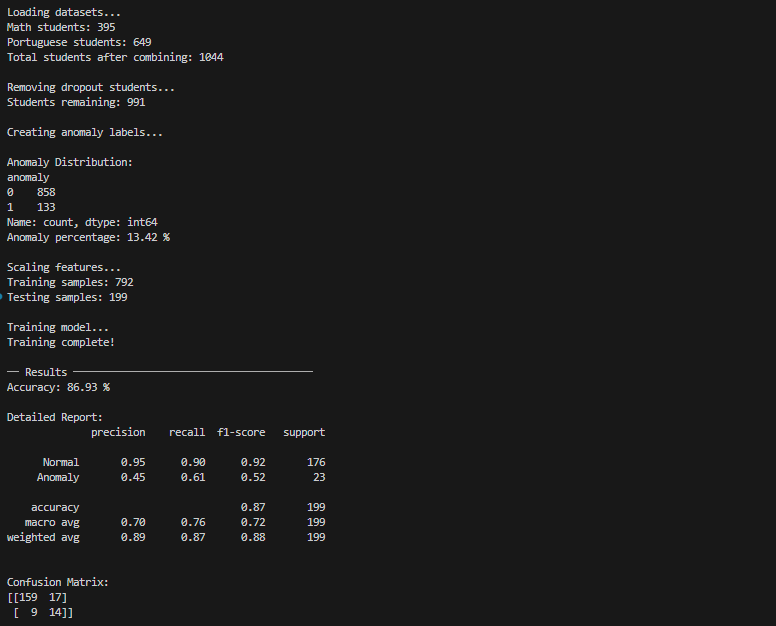
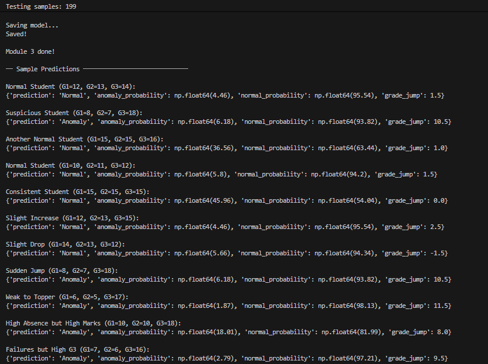

# AI-Assisted Academic Integrity Risk Detection System

This project is developed as part of our MCA final year industry project in collaboration with Xebia.
The goal is to detect potential academic integrity risks using a combination of transformer-based AI detection, writing style analysis, and student behavioral anomaly detection.

---

## Project Overview

Traditional plagiarism tools mainly focus on copied content but fail to detect AI-generated answers, contract cheating, and unusual student performance patterns. This system addresses all three by combining multiple detection signals into a single composite risk score.

The system flags suspicious cases for faculty review — it never makes direct accusations. All final decisions remain with the faculty member.

---

## Modules

### Module 1 — AI Content Detection (RoBERTa Transformer)

- Fine-tuned RoBERTa model from HuggingFace Transformers
- Trained on the full DAIGT-V2 dataset (44,868 essays) using Google Colab with Tesla T4 GPU
- Detects whether submitted text is AI-generated or human-written
- Model saved at: https://huggingface.co/Tushar101/module1-roberta
- Training Accuracy: approximately 99.60%

### Module 2 — Writing Style and AI Detection (Random Forest + TF-IDF)

- Extracts 7 handcrafted writing style features from each essay
- Applies TF-IDF vectorization using 500 most important word patterns
- Trains a Random Forest classifier with 100 decision trees
- Lightweight — runs on a standard laptop without GPU
- Training Accuracy: 98.17% on 8,968 test essays

### Module 3 — Behavioral Anomaly Detection (Random Forest + Rule-Based Logic)

- Analyzes student grade sequences (G1, G2, G3) from the UCI Student Performance dataset
- Flags students whose final grade jumps significantly above their G1 and G2 baseline
- Combines Random Forest predictions with rule-based logic for edge case handling
- Training Accuracy: 86.93% on 199 test records

### Module 4 — Combined Risk Assessment

- Integrates outputs from all three modules into a single composite risk score
- Applies dynamic weighting based on behavioral label
- Classifies students as Low Risk, Medium Risk, or High Risk

---

## Results

### Module 1 Output

- High accuracy during training (~98%)
- Model trained using HuggingFace Transformers (RoBERTa)
- Not fully integrated due to system constraints (GPU dependency)  

---

### Module 2 Output

**Model Training & Accuracy:**

**Sample Predictions:**

- Accuracy: 98.17%
- Correctly identifies human and AI-written essays with high confidence

---

### Module 3 Output

**Model Performance:**

**Sample Predictions:**

- Accuracy: 86.93%
- Detects sudden grade jumps and unusual academic performance patterns

---

## Datasets Used

| Dataset | Size | Purpose |
|---|---|---|
| DAIGT-V2 (Kaggle) | 44,868 essays | Module 1 and Module 2 training |
| PERSUADE 2.0 (GitHub) | 25,996 essays | Considered for Module 2, not used in final implementation |
| UCI Student Performance (UCI ML Repository) | 991 records after cleaning | Module 3 training |

---

## Tech Stack

| Category | Tool |
|---|---|
| Programming Language | Python 3.10 |
| AI Detection Model | RoBERTa (HuggingFace Transformers) |
| Text Classification | TF-IDF + Random Forest (scikit-learn) |
| Behavioral Detection | Random Forest + Rule-Based Logic |
| Dashboard | Streamlit |
| Backend API | FastAPI (planned) |
| Model Storage | HuggingFace Hub, Pickle |
| Version Control | Git + GitHub |
| Training Platform | Google Colab (Tesla T4 GPU) |

---

## Risk Assessment Logic

- High Risk: Composite score 70 or above
- Medium Risk: Composite score between 55 and 70
- Low Risk: Composite score below 55

When behavioral anomaly is detected, Module 3 weight increases to 40 percent.
When no behavioral anomaly, text detection modules carry 40 percent weight each.

---

## Key Features

- Detects AI-generated content  
- Detects abnormal academic behavior  
- Uses both ML and rule-based logic  
- Gives explainable output  

---

## What makes this project different?

- It does not directly accuse students  
- It only highlights **risk level**  
- Combines:
  - Text analysis  
  - Behavioral analysis  

---

## Method Used

- TF-IDF for text features  
- Random Forest for behavior analysis  
- Transformer model (RoBERTa) for deep learning  
- Rule-based logic for improving predictions  

---

## Example Outputs

- AI-written answer → detected as AI  
- Normal student → no issue  
- Sudden marks jump → flagged as anomaly  

---

## Future Work

- Integrate FastAPI backend for model serving
- Add SHAP and LIME explainability to dashboard
- Deploy on Streamlit Cloud and Render
- Integrate SQLite database for storing student records and risk history
- Resolve Module 1 local deployment issue for full integration

---

## Team

- Abhinandan Kumar (590013661)
- Tushar Mogha (590010547)
- Stuti Mishra (590015857)

School of Computer Science, UPES Dehradun — 2026

- Industry Mentor: Ms. Deborah Joy (Xebia)
- UPES Mentor: Dr. Sonam Saluja

---

## Conclusion

This project demonstrates that combining transformer-based AI detection, writing style analysis, and behavioral anomaly detection into a single unified system provides a more reliable and comprehensive approach to academic integrity monitoring than any single existing tool. The system is designed to assist faculty rather than replace human judgment, maintaining fairness and transparency throughout.
